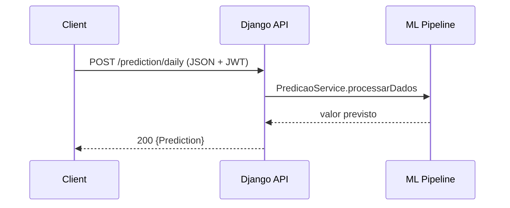

# RFC - Funcionamento Tecnico

## Contexto
API REST Django para analise de consumo de agua e classificacao de pH. Atua como servico especializado consumido por outra API backend. [Fonte: README]

## Arquitetura atual
- Framework: Django 5.x + Django REST Framework. [Fonte: README][Fonte: codigo]
- Autenticacao: JWT via SimpleJWT, header Authorization sem prefixo. [Fonte: codigo]
- Persistencia: SQLite (db.sqlite3) para auth/admin e metadados Django. [Fonte: codigo]
- ML/Analise: pipeline local com pandas/scikit-learn; modelos pH em disco. [Fonte: codigo]
- Observabilidade: logging em arquivo e console; Prometheus middleware e endpoints. [Fonte: codigo]
- Deploy: Docker + Gunicorn + WhiteNoise; opcional PM2. [Fonte: README][Fonte: codigo]

## Fluxo da requisicao
1. Cliente envia request HTTP com Authorization (token JWT). [Fonte: codigo]
2. View valida body JSON e estrutura (objeto/dict ou campos obrigatorios). [Fonte: codigo]
3. Servico de ML/analise processa dados em memoria. [Fonte: codigo]
4. Resposta JSON retornada com resultado ou erro. [Fonte: codigo]

## Componentes
- appSM.views: endpoints de predicao, analise estatistica e classificacao de pH. [Fonte: codigo]
- ml_pipeline.senseFlow_A: servicos de predicao e analise estatistica. [Fonte: codigo]
- ml_pipeline.senseflowQ: servico de classificacao de pH. [Fonte: codigo]
- projectSM.authentication: autenticacao JWT customizada (sem prefixo). [Fonte: codigo]
- projectSM.settings: configuracao de logs, staticfiles, DB, Prometheus. [Fonte: codigo]

## Contratos
Tabela de endpoints principais (todos com JWT, exceto /token e docs).

| Endpoint | Metodo | Objetivo | Entradas | Saidas | Erros | Dependencias | Efeitos colaterais |
| --- | --- | --- | --- | --- | --- | --- | --- |
| /token | POST | Obter JWT | username, password (JSON) | access/refresh | 401 | SimpleJWT | Nenhum |
| /prediction/daily | POST | Predicao diaria | {data: consumo} | {Prediction} | 400, 422, 500 | PredicaoService | Treino em memoria |
| /prediction/monthly | POST | Predicao mensal | {data: consumo} | {Prediction} | 400, 422, 500 | PredicaoService | Treino em memoria |
| /statistic/daily | POST | Classificacao diaria | {data: consumo} | {Data, Consumo, classificacao} | 400, 401, 422, 500 | AnaliseEstatisticaService | Tratamento de outliers |
| /statistic/monthly | POST | Classificacao mensal | {data: consumo} | {Data, Consumo, classificacao} | 400, 422, 500 | AnaliseEstatisticaService | Tratamento de outliers |
| /statistic/data | POST | Dados completos bandas | {data: consumo} | {dados: [..]} | 400, 401, 422, 500 | AnaliseEstatisticaService | Retorna ate 30 registros |
| /classify/ph | POST | Classificacao pH | {client_id, ph_value} | {client_id, ph_value, classification, confidence?, model_version} | 400, 404, 422, 500 | PHClassificationService | Carrega modelo do disco |
| /swagger | GET | Swagger UI | - | UI | - | drf-yasg | Nenhum |
| /redoc | GET | Redoc UI | - | UI | - | drf-yasg | Nenhum |
| / | GET | Swagger UI (root) | - | UI | - | drf-yasg | Nenhum |
| /admin | GET | Admin Django | - | UI | 302/403 | Django admin | Nenhum |

[Fontes: codigo]

## Sequencia operacional
Predicao e analise seguem fluxo request -> parse JSON -> validar -> processar -> responder.

## Modelo de dados
- Nao ha modelos Django definidos em appSM (sem tabelas de dominio). [Fonte: codigo]
- DB SQLite usada para auth/admin e tabelas internas do Django. [Fonte: codigo]
- Modelos de pH ficam em disco em /ml_pipeline/models/ph_classification/client_<id>/. [Fonte: codigo]

## Observabilidade
- Logs em console e arquivos rotativos (smartmonitor.log, errors.log). [Fonte: codigo]
- Middleware e endpoints Prometheus habilitados. [Fonte: codigo]

## Seguranca
- JWT via SimpleJWT; header Authorization sem prefixo Bearer. [Fonte: codigo]
- Endpoints de negocio exigem IsAuthenticated. [Fonte: codigo]
- /token e docs acessiveis sem autenticacao. [Fonte: codigo]

## Estrategia de evolucao
- Substituicao de modelos de predicao via injeccao de dependencia (interface ModeloPredicao). [Fonte: codigo]
- Modelos de pH versionados por nome de arquivo. [Fonte: codigo]

## Compatibilidade
- Expectativa de payload como JSON object (dict) com chaves de data no formato DD/MM/YYYY. [Fonte: codigo]
- Ordem dos dados segue ordem do JSON recebido; nao ha ordenacao por data. [Inferencia]

## Debito tecnico
- Serializer para validacao de datas existe mas nao e usado nas views. [Fonte: codigo]
- Endpoint de refresh token comentado. [Fonte: codigo]
- Sem OpenAPI exportado para versionamento de contrato. [Fonte: codigo]

## Perguntas abertas
- [GAP] Qual o comportamento esperado para ordenacao por data? [Inferencia]
- [GAP] Existe limite de tamanho de payload para predicoes/analises? [Inferencia]
- [GAP] Quais classes validas de pH por cliente e como versionar? [Inferencia]
- [GAP] Politica de rotacao e expurgo de modelos pH? [Inferencia]
