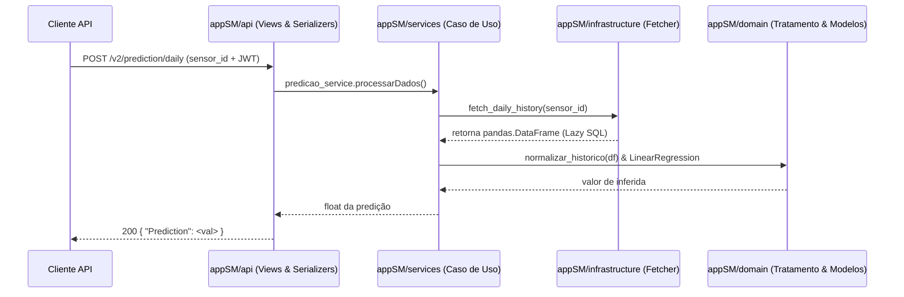

# RFC - Funcionamento Técnico e Arquitetura Limpa (V2)

## Contexto
API REST Django modular para análise de consumo de água e classificação de qualidade de pH. Atua como serviço de Machine Learning e estatética de alta performance consumido por outras aplicações e backends corporativos. [Fonte: README]

## Arquitetura Atual
- **Framework:** Django 5.x + Django REST Framework + drf-yasg.
- **Autenticação:** JWT via SimpleJWT com verificação no header `Authorization` (sem prefixo `Bearer`).
- **Padrão de Arquitetura:** Clean Architecture em 4 camadas independentes sob o app principal (`api`, `services`, `domain`, `infrastructure`).
- **Persistência de Negócio:** Operação *read-only* em banco externo SQL acessada por conectores com *Module-level Lazy Engine* em `infrastructure/db_fetcher.py`. SQLite mantido no projeto para tabelas administrativas e de controle do Django Admin.
- **ML & Estatística:** Módulos matemáticos puros e composicionais com pandas e scikit-learn na camada `domain/`; modelos `.joblib` em disco.
- **Fluxo de Dados Otimizado:** Passagem nativa de estruturas `pandas.DataFrame` end-to-end do banco de dados ao serviço de inferência sem round-trips para dicionários ou perdas temporais de indexação.
- **Observabilidade:** Logs rotativos em arquivo (`smartmonitor.log`, `errors.log`) e console integrados ao logger `appSM`.
- **Deploy:** Docker + Gunicorn + WhiteNoise; opcional PM2.

## Fluxo da Requisição
1. Cliente envia request HTTP com token JWT em `Authorization`.
2. View (`appSM/api/views.py`) valida o body e os identificadores usando Serializers DRF (`appSM/api/serializers.py`).
3. View invoca o serviço correspondente em `appSM/services/`, que por sua vez solicita dados à camada `infrastructure` (`ExternalDataFetcher`).
4. Os dados em formato `DataFrame` chegam limpos à camada `domain/tratamento.py`, onde ocorre a normalização por composição (`normalizar_historico`), preenchimento de medianas e regressões/cálculos de Bollinger.
5. A resposta tratada em JSON é devolvida em milissegundos com precisão matemática testada.

## Componentes da Estrutura Modular
- `appSM.api.views`: Conjunto consolidado de endpoints REST V2 para previsão, estatística e classificação de pH.
- `appSM.api.serializers`: Contratos DRF dedicados à validação estrita de requisições inteiras.
- `appSM.services.*`: Casos de uso e orquestração do fluxo de ML (`predicao_service`, `analise_estatistica_service`, `classification_history_service`, `ph_classification_service`).
- `appSM.domain.*`: Regras fundamentadas (normalização em `tratamento.py`, matemática em `regressao_linear.py` e persistência de pesos em `models/`).
- `appSM.infrastructure.db_fetcher`: Camada isolada do conector SQL com Lazy evaluation de conexões.
- `projectSM.authentication`: Adaptador JWT customizado sem prefixos.

## Contratos da API

Tabela oficial de endpoints ativos na versão 2:

| Endpoint | Método | Objetivo | Entradas | Saídas | Erros | Dependências | Efeitos colaterais |
| --- | --- | --- | --- | --- | --- | --- | --- |
| `/token` | POST | Obter JWT | `username`, `password` | `access`/`refresh` | 401 | SimpleJWT | Nenhum |
| `/v2/prediction/daily` | POST | Predição diária | `sensor_id` | `{Prediction}` | 400, 401, 404, 422, 500 | `ExternalDataFetcher`, `PredicaoService` | Consulta ao banco externo |
| `/v2/prediction/monthly` | POST | Predição mensal | `unidade_id`, `dispositivo_id?` | `{Prediction}` | 400, 401, 404, 422, 500 | `ExternalDataFetcher`, `PredicaoService` | Consulta ao banco externo |
| `/v2/statistic/daily` | POST | Classificação diária | `sensor_id` | `{Data, Consumo, classificacao}` | 400, 401, 404, 422, 500 | `ExternalDataFetcher`, `AnaliseEstatisticaService` | Consulta ao banco externo |
| `/v2/statistic/monthly` | POST | Classificação mensal | `unidade_id`, `dispositivo_id?` | `{Data, Consumo, classificacao}` | 400, 401, 404, 422, 500 | `ExternalDataFetcher`, `AnaliseEstatisticaService` | Consulta ao banco externo |
| `/v2/statistic/data` | POST | Dados completos de Bollinger | `sensor_id` | `{dados: [..]}` | 400, 401, 404, 422, 500 | `ExternalDataFetcher`, `AnaliseEstatisticaService` | Consulta ao banco externo |
| `/v2/classification/history`| POST| Histórico temporal | `type` (daily/monthly), `unidade_id`, `data_inicio`, `data_fim` ou `ano`| `{results: [...]}` | 400, 401, 404, 422, 500 | `ClassificationHistoryService`, `ExternalDataFetcher`| Processa contexto anterior e recorta período de saída |
| `/v2/classification/range` | POST | Alerta de faixa por período | `unidade_id`, `reference_period?` | `{outside_green_range, severity, classification, classification_label, reference_period}` | 400, 401, 404, 422, 500 | `ClassificationHistoryService` | Processa o período informado, ou o dia anterior, e verifica faixas -2, 1, 2 |
| `/classify/ph` | POST | Qualidade e pH | `client_id`, `ph_value` | `{client_id, ph_value, classification, ...}` | 400, 401, 404, 422, 500 | `PHClassificationService` | Carrega modelo `.joblib` em disco |
| `/swagger` | GET | Swagger UI | - | Documentação UI | - | drf-yasg | Nenhum |
| `/redoc` | GET | Redoc UI | - | Documentação UI | - | drf-yasg | Nenhum |
| `/admin` | GET | Admin Django | - | Interface de Admin | 302/403 | Django admin | Nenhum |

## Sequência Operacional (V2)

```mermaid
sequenceDiagram
    participant C as Cliente API
    participant API as appSM/api (Views & Serializers)
    participant S as appSM/services (Caso de Uso)
    participant I as appSM/infrastructure (Fetcher)
    participant D as appSM/domain (Tratamento & Modelos)
    C->>API: POST /v2/prediction/daily (sensor_id + JWT)
    API->>S: predicao_service.processarDados()
    S->>I: fetch_daily_history(sensor_id)
    I-->>S: retorna pandas.DataFrame (Lazy SQL)
    S->>D: normalizar_historico(df) & LinearRegression
    D-->>S: valor de inferida
    S-->>API: float da predição
    API-->>C: 200 { "Prediction": <val> }
```

## Modelo de Dados e Persistência
- Não há tabelas de domínio customizadas mantidas no SQLite nativo; os dados de faturamento residem exclusivamente no banco de histórico de leitura externa.
- O armazenamento e serialização dos pesos de Machine Learning são baseados no arquivo `.joblib` mantido na pasta de domínio: `appSM/domain/models/ph_classification/client_<id>/`.

## Segurança e Validações
- Autenticação restrita e mandatória via JWT com parser dedicado por classe customizada em `authentication.py`.
- Suíte de validação abrangida integralmente por testes de caracterização (regras matemáticas inalteráveis) e testes unitários de borda.
- Rotas públicas restritas a `/token` (obtenção de credenciais) e documentação OpenAPI.

## Conclusão de Débito Técnico e Evolução
- **Eliminação de Legado:** Código obsoleto de endpoints v1 descontinuados foi formalmente retirado (`views_deprecated.py`), purgando confusão nos contratos.
- **Round-trips em Memória Otimizados:** O overhead de conversões entre dicts Python e Pandas foi depurado; todas as operações ocorrem diretamente sobre instâncias de `DataFrame`.
- **Composição sobre Herança:** Abandonada a classe abstrata massiva `Tratamento` em favor do módulo utilitário puro `tratamento.py`.
- **Testes e Qualidade:** Cobertura reestruturada e unificada verificável através do comando `python manage.py test`.

## Perguntas em Aberto
- **[GAP]** Como projetar fallback automatizado caso o banco SQL externo de terceiros enfrente intermitência excessiva (cache ou circuito aberto)?
- **[GAP]** Qual a estratégia e cadência de re-treinamento ou subida das versões dos modelos `.joblib` para clientes no futuro?
